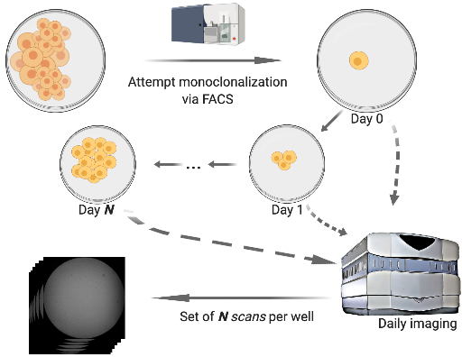
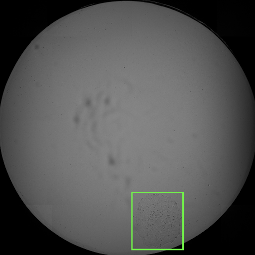

# Monoqlo
Monoqlo is a deep learning framework for automatically detecting and assessing the clonality of clonalized cell lines from daily imaging data. 

This repository implements an illustrative example of the Monoqlo framework. For full details on the design rationale and execution logic of Monoqlo, please see our preprint:
https://www.biorxiv.org/content/10.1101/2020.12.28.424610v1

Monoqlo serves as a useful tool in laboratory automation scenarios in which cells are monoclonalized and imaged, such as illustrated in the figure above.

# Installation

The Monoqlo framework itself does not require installation other than downloading this repository, but has various requirements and dependencies which must be installed (see below)

# Recommended Hardware

- CUDA-capable GPU (NVIDIA RTX 2080 Ti / 3080 Ti or similar)
  - (The framework can be executed on a CPU, but will benefit hugely from GPU acceleration due to the large number of images that must be analyzed.)
- 16GB+ memory
- High-end CPU (Intel Core i9-9900k or similar)

# Software Requirements and Dependencies

Note - the software versions indicated here are those that were uesd during testing. Other versions may work, however we cannot guarantee there will not be compatibility issues.

Note - it is highly advised to use an environment manager (e.g. Anaconda) when installing these software and dependencies.

Requirements:
- Python3 (version 3.6.9 recommended)
- CUDA Toolkit version 10.0
- pip (version 20.2.2)

Python3 libraries (can be installed using pip):
- Tensorflow (GPU version) version 1.14
- Keras version 2.3.1 or 2.3.2
- Numpy 1.18.5
- OpenCV (cv2) version 4.1.1
- Keras-RetinaNet:
  - To install this module, navigate to the "keras_retinanet_master" directory within the Monoqlo master directory, and set it as your working directory.
  - Enter the command "pip install . --user"

Estimated total install time: <15 minutes, excepting cases where errors are encountered while installing dependencies.

# Useage

1. In order to test the framework's execution, you must download an example dataset. An example dataset, consisting of a single plate, can be downloaded from the following link:

2. Once you have downloaded the zip folder from the link above, extract the data and place the resulting directory (named "Demo_Data") within top level of the master Monoqlo install directory (you can replace the existing, empty folder with the same name)

3. Navigate to the top level of the master Monoqlo install directory, so that it is set as your working directory

4. Run "python3 mq_main.py" in terminal, or in your environment of choice.

Following step 4, the framework will begin analyzing the demonstration data by default (this can be configured) and real-time information will be printed to the standard output.

# Expected outputs

For each well processed, the algorithm will place cropped colony images from Monoqlo's predictions and algorithmic processing in day-specific folders within the "Processing_Crops" directory. For each image, all detected objects will be drawn, with colonies/cells being indicated in green and "differentiation" being indicated in red. Writing these images to file is purely for the purposes of visual inspection; they are not read back into memory for any purpose and do not affect final results/well classifications.

For each well, the algorithm also outputs flat files, summarizing the results of well clonality classification, to the "Outputs" directory.

