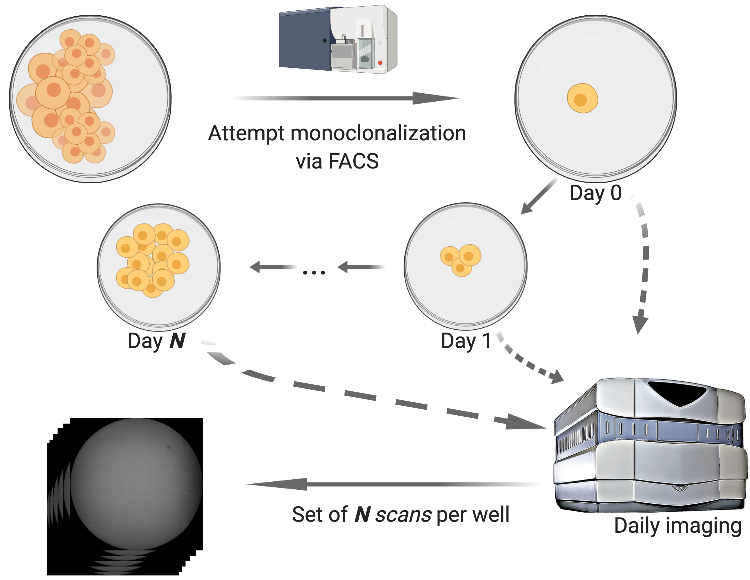

# Monoqlo
Monoqlo is a deep learning framework for automatically detecting and assessing the clonality of clonalized cell lines from daily imaging data. 

This repository implements an illustrative example of the Monoqlo framework. For full details on the design rationale and execution logic of Monoqlo, please see our preprint:
https://www.biorxiv.org/content/10.1101/2020.12.28.424610v1

Monoqlo serves as a useful tool in laboratory automation scenarios in which cells are monoclonalized and imaged, such as illustrated in the figure above.

# Installation & System Requirements
